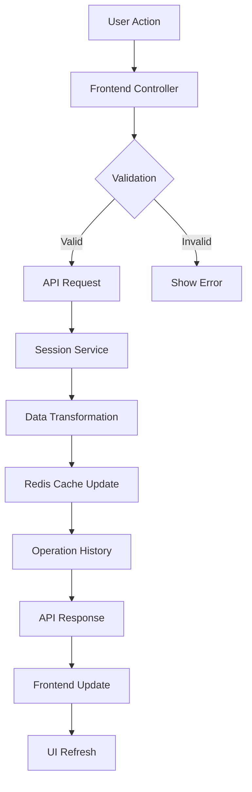
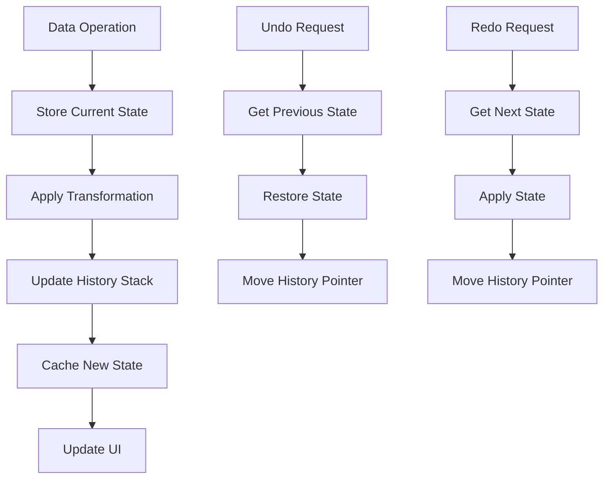

# Data Tools & Session Management Architecture

## 📋 Overview
HydroML's Data Tools system provides comprehensive data manipulation capabilities with persistent session management, advanced table interfaces, and real-time data transformations. This guide consolidates all data tools architecture documentation into a unified reference.

**System Status**: ✅ **PRODUCTION READY** - Fully refactored modular architecture  
**Architecture Version**: 2.0 (Post-Refactoring)  
**Last Updated**: August 2025

## 🏗️ System Architecture Overview

### Core Philosophy
- **Session-Based Workflows**: Persistent data manipulation with full undo/redo capabilities
- **Modular Frontend**: Clean separation of concerns with specialized modules
- **API-First Design**: RESTful endpoints for all data operations
- **Real-Time Updates**: Instant feedback on data transformations
- **Performance Optimized**: Redis caching and pagination for large datasets

### Architecture Stack
```
Data Tools Technology Stack
├── Backend Session Management
│   ├── Django REST API         # Session lifecycle and operations
│   ├── Redis Cache            # Session data persistence
│   ├── PostgreSQL             # Metadata and permanent storage
│   └── Pandas Integration     # Data manipulation engine
├── Frontend Data Interface
│   ├── TanStack Table         # Advanced data grid component
│   ├── Session Controllers    # State management
│   ├── Alpine.js              # Reactive user interface
│   └── Grove Design System    # Consistent UI components
└── Data Processing
    ├── Column Transformations # Data type changes, renaming
    ├── Missing Data Handling  # Imputation and cleaning
    ├── Operation History      # Undo/redo functionality
    └── Real-time Analytics    # Live statistics and summaries
```

## 🔧 Backend Architecture

### Django API Structure
**Location**: `data_tools/views/api/`

```
Modular API Architecture (Post-Refactoring)
data_tools/views/api/
├── __init__.py                      # API registration and configuration
├── pagination_api.py                # Data pagination and filtering
└── session_api/                     # Session management modules
    ├── __init__.py                  # Session API configuration
    ├── utils.py                     # Shared utilities (DRY principle)
    ├── session_lifecycle_views.py   # Session CRUD operations
    ├── session_operations_views.py  # Undo/redo and history
    ├── column_transformation_views.py # Data transformations
    └── data_analysis_views.py       # Analytics and statistics
```

### Session Management System

#### Service Layer Architecture
**Location**: `data_tools/services/`

```
Session Management Services
├── session_manager.py          # Core session management
├── session_initializer.py      # Session creation and setup
├── session_transformer.py     # Data transformation operations
├── session_operations.py      # Operation tracking and history
├── session_lifecycle.py       # Session state management
├── session_metadata.py        # Session metadata handling
├── session_cache.py           # Redis caching integration
├── session_history.py         # Operation history tracking
└── secure_serialization.py    # Secure data serialization
```

#### Session Lifecycle Management
```python
# session_lifecycle.py - Core session management
class SessionLifecycleService:
    """Manages the complete lifecycle of data manipulation sessions"""
    
    def create_session(self, datasource_id, user_id):
        """Initialize new session with original DataFrame"""
        # Create session metadata
        # Load data from datasource
        # Initialize Redis cache
        # Set up operation history
    
    def get_session_status(self, session_id):
        """Get current session state and metadata"""
        # Return session info, operation count, data shape
    
    def close_session(self, session_id, save_changes=False):
        """Close session and optionally save changes"""
        # Persist final state if requested
        # Clear Redis cache
        # Update session metadata
```

#### Data Transformation Operations
```python
# session_transformer.py - Data manipulation
class SessionTransformerService:
    """Handles all data transformation operations within sessions"""
    
    def rename_column(self, session_id, old_name, new_name):
        """Rename column with operation tracking"""
        # Load current DataFrame
        # Apply rename operation
        # Track operation in history
        # Update cached data
    
    def change_column_type(self, session_id, column_name, new_type):
        """Change column data type with validation"""
        # Validate type conversion
        # Apply transformation
        # Handle conversion errors
        # Update session state
    
    def fill_missing_values(self, session_id, column_name, fill_value):
        """Fill missing values with specified strategy"""
        # Analyze missing data
        # Apply filling strategy
        # Track transformation
        # Update statistics
```

#### Operation History and Undo/Redo
```python
# session_operations.py - History management
class SessionOperationsService:
    """Manages operation history and undo/redo functionality"""
    
    def add_operation(self, session_id, operation_type, parameters):
        """Add operation to history stack"""
        # Create operation record
        # Store current state snapshot
        # Update operation counter
    
    def undo_operation(self, session_id):
        """Revert last operation"""
        # Get last operation
        # Restore previous state
        # Update operation pointer
    
    def redo_operation(self, session_id):
        """Reapply undone operation"""
        # Get next operation
        # Apply operation again
        # Update operation pointer
    
    def get_operation_history(self, session_id):
        """Return complete operation history"""
        # Return chronological operation list
        # Include operation metadata
```

### API Endpoints Documentation

#### Session Lifecycle Endpoints
```python
# session_lifecycle_views.py
POST   /api/sessions/initialize/      # Create new session
GET    /api/sessions/status/<id>/     # Get session status
DELETE /api/sessions/clear/<id>/      # Clear session data
POST   /api/sessions/save/<id>/       # Save as new datasource
```

#### Session Operations Endpoints
```python
# session_operations_views.py
POST   /api/sessions/undo/<id>/       # Undo last operation
POST   /api/sessions/redo/<id>/       # Redo operation
GET    /api/sessions/history/<id>/    # Get operation history
```

#### Data Transformation Endpoints
```python
# column_transformation_views.py
POST   /api/sessions/rename-column/<id>/     # Rename column
POST   /api/sessions/change-type/<id>/       # Change column type
POST   /api/sessions/fill-missing/<id>/      # Fill missing values
POST   /api/sessions/drop-columns/<id>/      # Drop columns
```

#### Data Analysis Endpoints
```python
# data_analysis_views.py
GET    /api/sessions/summary/<id>/           # Data summary statistics
GET    /api/sessions/column-info/<id>/       # Column information
GET    /api/sessions/missing-data/<id>/      # Missing data analysis
```

### Shared Utilities and DRY Principles

#### Common Utilities
```python
# utils.py - Centralized utilities
def validate_session_and_datasource(session_id, user_id):
    """Unified session and datasource validation"""
    # Check session exists and belongs to user
    # Validate datasource accessibility
    # Return session and datasource objects

def validate_active_session(session_id):
    """Verify session is active and accessible"""
    # Check session state
    # Validate cache availability
    # Return session metadata

def format_success_response(data, message="Operation completed"):
    """Standardized success response format"""
    return {
        'success': True,
        'message': message,
        'data': data,
        'timestamp': timezone.now().isoformat()
    }

def log_and_handle_exception(exception, context):
    """Centralized exception handling and logging"""
    # Log exception with context
    # Return appropriate error response
    # Handle specific exception types
```

## 🖥️ Frontend Architecture

### Modular JavaScript Structure
**Location**: `data_tools/static/data_tools/js/`

```
Frontend Architecture (Post-Refactoring)
data_tools/static/data_tools/js/
├── Core Infrastructure
│   ├── data_studio_api.js           # API client and HTTP utilities
│   └── tanstack-bootstrap.js        # TanStack Table initialization
├── Session Management
│   ├── modules/session/
│   │   ├── session-manager.js       # Session state management
│   │   ├── session-ui-controller.js # UI components for sessions
│   │   └── session-coordinator.js   # Session event coordination
├── Data Grid System
│   ├── modules/tanstack-table-controller.js # TanStack Table controller
│   ├── tanstack-table.js           # Table configuration and setup
│   └── tanstack/                   # TanStack-specific modules
│       ├── column-definitions.js   # Column configuration
│       ├── table-state-manager.js  # Table state persistence
│       └── filtering-sorting.js    # Data filtering and sorting
├── User Interface
│   ├── modules/ui/
│   │   ├── sidebar-controller.js   # Sidebar management
│   │   ├── notification-manager.js # User notifications
│   │   └── modal-controller.js     # Modal dialog management
└── Legacy Components (Archived)
    └── legacy/                     # Pre-refactoring code
        ├── data_studio.js          # Original monolith (archived)
        └── data_studio_sidebar.js  # Old sidebar code
```

### Session Management Frontend

#### Session State Manager
```javascript
// modules/session/session-manager.js
class SessionManager {
    constructor() {
        this.currentSession = null;
        this.operationHistory = [];
        this.isLoading = false;
    }
    
    async initializeSession(datasourceId) {
        // Create new session via API
        // Set up local state
        // Initialize UI components
        // Load initial data
    }
    
    async applyOperation(operationType, parameters) {
        // Send operation to API
        // Update local state
        // Refresh data grid
        // Update operation history UI
    }
    
    async undoOperation() {
        // Call undo API endpoint
        // Update local state
        // Refresh UI components
    }
    
    async redoOperation() {
        // Call redo API endpoint
        // Update local state
        // Refresh UI components
    }
}
```

#### Session UI Controller
```javascript
// modules/session/session-ui-controller.js
class SessionUIController {
    constructor(sessionManager) {
        this.sessionManager = sessionManager;
        this.setupEventListeners();
    }
    
    setupEventListeners() {
        // Column transformation buttons
        // Undo/redo buttons
        // Session save/clear actions
    }
    
    updateSessionStatus(sessionData) {
        // Update session information display
        // Show operation count
        // Display data shape info
    }
    
    showOperationHistory(history) {
        // Display operation timeline
        // Enable operation navigation
        // Show operation details
    }
}
```

### TanStack Table Integration

#### Advanced Data Grid Implementation
```javascript
// modules/tanstack-table-controller.js
class TanStackTableController {
    constructor(containerId, options = {}) {
        this.container = document.getElementById(containerId);
        this.table = null;
        this.data = [];
        this.columns = [];
        this.options = {
            pagination: true,
            sorting: true,
            filtering: true,
            ...options
        };
    }
    
    async initializeTable() {
        // Set up column definitions
        // Configure pagination
        // Enable sorting and filtering
        // Set up event handlers
    }
    
    updateData(newData) {
        // Update table data
        // Preserve current state (sorting, filtering)
        // Handle data type changes
        // Update column definitions if needed
    }
    
    handleColumnTransformation(columnName, transformation) {
        // Apply visual feedback
        // Update column definition
        // Trigger data refresh
    }
}
```

#### Column Configuration System
```javascript
// tanstack/column-definitions.js
class ColumnDefinitionManager {
    static createColumnDef(columnName, dataType, options = {}) {
        return {
            accessorKey: columnName,
            header: columnName,
            cell: this.getCellRenderer(dataType),
            sortingFn: this.getSortingFunction(dataType),
            filterFn: this.getFilterFunction(dataType),
            ...options
        };
    }
    
    static getCellRenderer(dataType) {
        // Return appropriate cell renderer for data type
        // Handle null/missing values
        // Apply formatting based on type
    }
    
    static getSortingFunction(dataType) {
        // Return appropriate sorting function
        // Handle edge cases and null values
    }
    
    static getFilterFunction(dataType) {
        // Return appropriate filter function
        // Support different filter types by data type
    }
}
```

## 🎨 User Interface Architecture

### Grove Design System Integration

#### Data Studio Template Structure
**Location**: `data_tools/templates/data_tools/data_studio.html`

```html
<!-- Grove-based Data Studio Interface -->
<div class="grove-card" id="data-studio-container">
    <!-- Session Header -->
    <div class="grove-card-header">
        <h2 class="grove-card-title">Data Studio</h2>
        <div class="grove-session-controls">
            <!-- Session status and controls -->
        </div>
    </div>
    
    <!-- Main Content Area -->
    <div class="grove-card-content">
        <!-- Data Grid Container -->
        <div id="tanstack-table-container" class="data-studio-table-container">
            <!-- TanStack Table renders here -->
        </div>
        
        <!-- Operation Sidebar -->
        <div class="grove-sidebar" id="operations-sidebar">
            <!-- Transformation controls -->
        </div>
    </div>
</div>
```

#### Sidebar Component Architecture
**Location**: `data_tools/templates/data_tools/partials/_data_studio_sidebar.html`

```html
<!-- Modular Sidebar with Grove Components -->
<div class="grove-sidebar-container">
    <!-- Session Information -->
    <div class="grove-card grove-card--info">
        <div class="grove-card-header">
            <h3 class="grove-card-title">Session Info</h3>
        </div>
        <div class="grove-card-content">
            <!-- Session metadata display -->
        </div>
    </div>
    
    <!-- Column Operations -->
    <div class="grove-card">
        <div class="grove-card-header">
            <h3 class="grove-card-title">Column Operations</h3>
        </div>
        <div class="grove-card-content">
            <!-- Transformation controls -->
        </div>
    </div>
    
    <!-- Operation History -->
    <div class="grove-card">
        <div class="grove-card-header">
            <h3 class="grove-card-title">Operation History</h3>
        </div>
        <div class="grove-card-content">
            <!-- Undo/redo timeline -->
        </div>
    </div>
</div>
```

### CSS Architecture for Data Tools

#### Component-Specific Styling
**Location**: `data_tools/static/data_tools/css/`

```
Data Tools CSS Architecture
├── data-studio-extensions.css      # Data Studio specific extensions
├── data-studio-sidebar.css         # Sidebar component styling
├── tanstack-table.css              # Table component styling
└── data-studio-legacy.css          # Legacy components (being phased out)
```

#### Data Studio Extensions
```css
/* data-studio-extensions.css */
.data-studio-container {
    display: flex;
    height: 100vh;
    background: var(--grove-bg-surface);
}

.data-studio-main-content {
    flex: 1;
    display: flex;
    flex-direction: column;
    padding: var(--space-4);
}

.data-studio-table-container {
    flex: 1;
    min-height: 0; /* Allow flex shrinking */
    border: 1px solid var(--grove-border-primary);
    border-radius: var(--radius-lg);
}

/* Session Controls */
.grove-session-controls {
    display: flex;
    gap: var(--space-2);
    align-items: center;
}

.session-status-indicator {
    padding: var(--space-1) var(--space-3);
    border-radius: var(--radius-md);
    font-size: var(--text-sm);
    font-weight: 500;
}

.session-status--active {
    background: var(--grove-success-subtle);
    color: var(--grove-success-dark);
}

.session-status--idle {
    background: var(--grove-warning-subtle);
    color: var(--grove-warning-dark);
}
```

## 📊 Data Flow Architecture

### Session Data Flow


### Operation History Flow


### Real-Time Data Pipeline
```
Data Processing Pipeline
├── Data Input
│   ├── File Upload      # CSV, Excel, JSON files
│   ├── Database Import  # SQL connections
│   └── API Integration  # External data sources
├── Session Creation
│   ├── Data Validation  # Schema validation
│   ├── Type Inference   # Automatic type detection
│   └── Cache Setup      # Redis session storage
├── Transformation Layer
│   ├── Column Operations # Rename, type change, drop
│   ├── Data Cleaning    # Missing value handling
│   ├── Filtering        # Row filtering operations
│   └── Aggregation      # Statistical operations
└── Output Processing
    ├── Data Export      # Various format support
    ├── Visualization    # Chart generation
    └── Model Integration # ML model input
```

## 🔐 Security Architecture

### Session Security
```python
# secure_serialization.py
class SecureSessionSerializer:
    """Secure serialization for session data"""
    
    @staticmethod
    def serialize_dataframe(df, session_key):
        """Serialize DataFrame with encryption"""
        # Compress DataFrame
        # Encrypt sensitive data
        # Add integrity checksum
        # Store in Redis with TTL
    
    @staticmethod
    def deserialize_dataframe(session_id, session_key):
        """Deserialize DataFrame with validation"""
        # Retrieve from Redis
        # Verify integrity
        # Decrypt data
        # Return DataFrame
```

### Access Control
```python
# Session access validation
def validate_session_access(session_id, user_id):
    """Validate user can access session"""
    session = Session.objects.get(id=session_id)
    if session.user_id != user_id:
        raise PermissionDenied("Access denied")
    return session
```

## 🚀 Performance Optimization

### Caching Strategy
```python
# session_cache.py
class SessionCacheManager:
    """Redis-based session caching"""
    
    def __init__(self):
        self.redis_client = get_redis_connection()
        self.default_ttl = 3600  # 1 hour
    
    def cache_dataframe(self, session_id, df):
        """Cache DataFrame with compression"""
        # Serialize with pickle + compression
        # Set with TTL
        # Track cache size
    
    def get_cached_dataframe(self, session_id):
        """Retrieve cached DataFrame"""
        # Get from Redis
        # Deserialize
        # Update access time
```

### Database Optimization
```sql
-- Session management indexes
CREATE INDEX idx_session_user_created ON data_tools_session(user_id, created_at);
CREATE INDEX idx_session_active ON data_tools_session(is_active, created_at);
CREATE INDEX idx_operation_session_order ON data_tools_operation(session_id, operation_order);

-- Partial indexes for active sessions
CREATE INDEX idx_active_sessions ON data_tools_session(id) WHERE is_active = TRUE;
```

### Frontend Performance
```javascript
// Performance optimizations
class PerformanceOptimizer {
    static debounce(func, wait) {
        // Debounce frequent operations
    }
    
    static throttle(func, limit) {
        // Throttle expensive operations
    }
    
    static memoize(func) {
        // Cache expensive computations
    }
}

// Usage in table updates
const debouncedTableUpdate = PerformanceOptimizer.debounce(
    (data) => table.updateData(data),
    300
);
```

## 🧪 Testing Architecture

### Backend Testing Structure
```python
# tests/data_tools/
├── test_session_manager.py         # Session management tests
├── test_session_operations.py      # Undo/redo functionality tests
├── test_data_transformations.py    # Data operation tests
├── test_api_endpoints.py           # API endpoint tests
└── test_performance.py             # Performance and load tests

# Example test structure
class TestSessionManager:
    def test_create_session(self):
        """Test session creation with valid datasource"""
        
    def test_session_data_persistence(self):
        """Test data persists across operations"""
        
    def test_concurrent_session_access(self):
        """Test thread safety of session operations"""
```

### Frontend Testing Strategy
```javascript
// tests/frontend/
├── session-manager.test.js         # Session state management
├── table-controller.test.js        # TanStack Table integration
├── api-client.test.js              # API communication
└── ui-components.test.js           # UI component behavior

// Example test
describe('SessionManager', () => {
    test('should initialize session correctly', async () => {
        const sessionManager = new SessionManager();
        const session = await sessionManager.initializeSession(datasourceId);
        expect(session).toBeDefined();
        expect(session.id).toMatch(/^[0-9a-f-]{36}$/);
    });
});
```

## 📈 Monitoring and Analytics

### Session Metrics
```python
# session_metadata.py
class SessionMetrics:
    """Track session usage and performance metrics"""
    
    @staticmethod
    def track_operation(session_id, operation_type, duration):
        """Track operation performance"""
        metrics = {
            'session_id': session_id,
            'operation_type': operation_type,
            'duration_ms': duration,
            'timestamp': timezone.now()
        }
        # Send to monitoring system
    
    @staticmethod
    def track_session_lifecycle(session_id, event_type):
        """Track session creation, closure, etc."""
        # Track session lifecycle events
```

### Performance Monitoring
- **Session Duration**: Track time users spend in sessions
- **Operation Frequency**: Most common data transformations
- **Error Rates**: Operation success/failure rates
- **Cache Hit Rates**: Redis cache performance
- **API Response Times**: Endpoint performance metrics

## 🔄 Future Roadmap

### Phase 1: Advanced Features (Q3 2025)
- **Collaborative Sessions**: Multi-user data manipulation
- **Advanced Analytics**: Statistical analysis tools
- **Custom Transformations**: User-defined transformation functions
- **Data Validation Rules**: Automated data quality checks

### Phase 2: Performance Enhancements (Q4 2025)
- **Streaming Data**: Real-time data processing
- **Distributed Sessions**: Multi-node session management
- **Advanced Caching**: Intelligent cache eviction
- **Background Processing**: Async heavy operations

### Phase 3: Enterprise Features (Q1 2026)
- **Audit Trails**: Complete operation logging
- **Access Controls**: Fine-grained permissions
- **Data Governance**: Compliance and privacy tools
- **API Extensions**: Custom plugin system

---

**Status**: ✅ **COMPLETE** - Data Tools Architecture comprehensively documented  
**Files Consolidated**: 4 → 1 (This comprehensive guide)  
**Refactoring**: Complete modular architecture with 17 specialized components  
**Performance**: Optimized with Redis caching, pagination, and debounced operations  
**Documentation Quality**: Complete with code examples, diagrams, and testing strategies