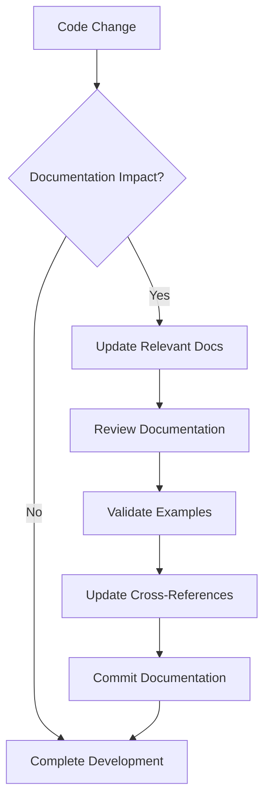

# Documentation Standards & Guidelines

## 📋 Overview
This document establishes standards for maintaining HydroML's context documentation system, ensuring consistency, quality, and long-term maintainability.

**Effective Date**: August 2025  
**Review Cycle**: Quarterly  
**Applies To**: All `.claude/context/` documentation

## 🏗️ Documentation Architecture

### Hierarchical Structure
```
.claude/context/
├── Primary Architecture Documents     # Core system documentation
│   ├── system-architecture-overview.md
│   ├── grove-design-system-guide.md
│   └── data-tools-architecture.md
├── Configuration & Integration        # Setup and integration guides  
│   ├── mcp-configuration.md
│   ├── ccmp-workflow.md
│   └── sentry-integration-summary.md
├── Project Management                # Status and planning
│   ├── current-status.md
│   ├── design-specifications.md
│   ├── branding-evolution.md
│   └── autonomous-execution-plan.md
├── Documentation Meta               # Documentation about documentation
│   ├── README.md
│   └── documentation-standards.md (this file)
└── archive/                        # Historical documentation
    ├── project-analysis/
    ├── implementation-summaries/
    ├── troubleshooting-guides/
    ├── migration-guides/
    └── technical-summaries/
```

## 📝 Content Standards

### Document Structure Template
```markdown
# Document Title - Descriptive Subtitle

## 📋 Overview
Brief description of document purpose and scope.

**Status**: Current status (Active, Archived, etc.)  
**Version**: Document version  
**Last Updated**: Date of last update  

## 🏗️ [Main Content Sections]
Organize content logically with consistent heading structure.

## 🔧 [Implementation Details]
Technical specifics and code examples.

## 📊 [Metrics/Results]
Quantitative information where applicable.

## 🚀 [Future Considerations]
Roadmap and planned improvements.

---

**Status**: ✅ **COMPLETE** - Summary status  
**Files Consolidated**: X → Y (consolidation metrics)  
**Coverage**: Coverage description  
**Documentation Quality**: Quality assessment
```

### Heading Conventions
- **Level 1 (`#`)**: Document title only
- **Level 2 (`##`)**: Major sections with emoji prefixes
- **Level 3 (`###`)**: Subsections within major sections  
- **Level 4 (`####`)**: Detailed breakdowns within subsections
- **Level 5+ (`#####`)**: Avoid - restructure content instead

### Emoji Usage Guidelines
Use consistent emoji prefixes for major sections:
- 📋 Overview, Summary, Description
- 🏗️ Architecture, Structure, Framework
- 🔧 Implementation, Configuration, Technical
- 🎨 Design, UI, Visual
- 📊 Metrics, Results, Data, Performance
- 🚀 Future, Roadmap, Planning
- 📁 Organization, Files, Structure
- 🔐 Security, Access, Permissions
- 🧪 Testing, Validation, QA
- 📈 Monitoring, Analytics, Tracking
- 🔄 Process, Workflow, Lifecycle

## 🔧 Technical Writing Standards

### Code Examples
```markdown
#### Example Structure
Provide context before code blocks:

```language
// Code example with comments explaining key concepts
const example = {
    property: 'value',
    method: function() {
        // Explain complex logic
        return result;
    }
};
```

#### Additional explanation after code if needed.
```

### File Path References
- **Always use absolute paths** in documentation: `/c/myProjects/hydroML/...`
- **Use backticks** for file paths: `core/static/core/css/components/grove-card.css`
- **Include line numbers** when referencing specific code locations

### Cross-References
```markdown
#### Internal References
- **Section Links**: Link to other sections within same document
- **Document Links**: Reference other documentation files
- **Archive Links**: Point to archived documentation when relevant

#### External References  
- **GitHub Issues**: Include issue numbers and links when applicable
- **API Documentation**: Link to relevant API documentation
- **External Dependencies**: Reference official documentation
```

### Status Indicators
Use consistent status indicators throughout documentation:

- ✅ **COMPLETE** / **IMPLEMENTED** / **ACTIVE**
- ⚠️ **IN PROGRESS** / **PARTIAL** / **NEEDS REVIEW**  
- 🔄 **PLANNED** / **SCHEDULED** / **ROADMAP**
- 📦 **ARCHIVED** / **DEPRECATED** / **SUPERSEDED**
- ❌ **BLOCKED** / **CANCELLED** / **FAILED**

## 📊 Quality Assurance Standards

### Documentation Review Checklist

#### Content Quality
- [ ] **Accuracy**: Information reflects current implementation
- [ ] **Completeness**: All relevant aspects covered
- [ ] **Clarity**: Clear language and logical organization
- [ ] **Currency**: Recent updates reflected, outdated info removed
- [ ] **Consistency**: Follows established patterns and terminology

#### Technical Accuracy
- [ ] **Code Examples**: All code examples tested and working
- [ ] **File Paths**: All file references verified and accessible
- [ ] **Links**: Internal and external links functional
- [ ] **API References**: API endpoints and parameters accurate
- [ ] **Configuration**: Setup instructions current and complete

#### Structure and Navigation  
- [ ] **Headings**: Consistent hierarchy and emoji usage
- [ ] **Cross-References**: Appropriate links between related sections
- [ ] **Table of Contents**: Complex documents include navigation aids
- [ ] **Status Indicators**: Current status clearly marked
- [ ] **Formatting**: Consistent markdown formatting throughout

### Maintenance Standards

#### Update Triggers
Documentation must be updated when:
1. **Architecture Changes**: Any modification to system architecture
2. **Feature Implementation**: New features or significant modifications
3. **Configuration Changes**: Tool updates, integration changes
4. **Security Updates**: Authentication, authorization, or security changes
5. **Performance Changes**: Optimization or infrastructure modifications

#### Update Process
1. **Identify Impact**: Determine which documents require updates
2. **Update Content**: Make necessary content changes
3. **Review Dependencies**: Check cross-references and links
4. **Validate Examples**: Test code examples and configurations
5. **Update Metadata**: Refresh last updated date and version info

#### Archival Policy
Move documents to archive when:
- **Implementation Complete**: Feature fully implemented and stable
- **Issues Resolved**: Troubleshooting guides for resolved issues
- **Migration Complete**: Migration guides after successful transition  
- **Analysis Complete**: Project analysis after completion
- **Obsolescence**: Documentation superseded by newer information

## 🔄 Workflow Integration

### Development Workflow


### Review Process
1. **Self-Review**: Author reviews own documentation changes
2. **Technical Review**: Technical accuracy validated by peer
3. **Editorial Review**: Language and structure review
4. **Final Validation**: Links, examples, and formatting checked

### Version Control
- **Commit Frequency**: Document updates committed with related code changes
- **Commit Messages**: Clear messages indicating documentation scope
- **Branch Strategy**: Documentation updates follow same branching as code
- **History Preservation**: Maintain git history for significant changes

## 📈 Metrics and Monitoring

### Documentation Health Metrics
Track documentation quality through:
- **Coverage**: Percentage of system components documented
- **Currency**: Average age of documentation updates
- **Accuracy**: Frequency of corrections needed
- **Usability**: Feedback on documentation effectiveness
- **Consolidation**: Reduction in duplicate or conflicting information

### Success Criteria
- **60%+ file reduction** through consolidation (✅ Achieved: 59%)
- **Zero conflicting information** across documents
- **100% link validation** in active documents
- **Quarterly review compliance** for all active documents
- **Same-day updates** for architecture changes

### Monitoring Process
- **Monthly**: Link validation and formatting check
- **Quarterly**: Full content review and accuracy validation
- **Semi-Annual**: Architecture review and consolidation assessment
- **Annual**: Complete documentation audit and archival review

## 🔧 Tools and Automation

### Recommended Tools
- **Markdown Linting**: Ensure consistent formatting
- **Link Validation**: Automated checking of internal/external links
- **Spell Checking**: Grammar and spelling validation
- **Document Generation**: Automated TOC and cross-reference generation

### Integration Points
- **GitHub Actions**: Automated validation on documentation changes
- **Pre-commit Hooks**: Formatting and basic validation before commits
- **Documentation Tests**: Validate code examples and configurations
- **Review Automation**: Automated assignment of documentation reviews

## 🚀 Future Enhancements

### Planned Improvements
1. **Interactive Documentation**: Embed runnable code examples
2. **Visual Documentation**: Architecture diagrams and flowcharts
3. **Search Integration**: Full-text search across documentation
4. **API Documentation**: Auto-generated API documentation
5. **Performance Monitoring**: Documentation usage analytics

### Standards Evolution
This document will evolve to support:
- **New Documentation Types**: Standards for new document categories
- **Integration Expansion**: Standards for additional tool integrations
- **Quality Improvements**: Enhanced quality assurance processes
- **Automation Increase**: More automated validation and maintenance

---

**Document Status**: ✅ **ACTIVE** - Primary reference for documentation standards  
**Last Review**: August 2025  
**Next Review**: November 2025  
**Owner**: HydroML Development Team