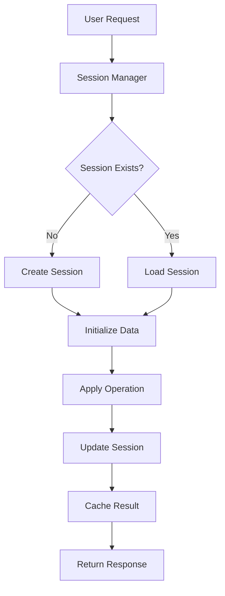

# HydroML System Architecture - Comprehensive Overview

## 📋 Overview
HydroML is a modern machine learning platform built on Django with a component-based frontend architecture. This comprehensive guide consolidates all system architecture documentation into a unified reference for developers and system administrators.

**Architecture Version**: 2.0 (Post-Grove Migration)  
**Status**: Active Development  
**Last Updated**: August 2025

## 🏗️ System Overview

### Core Philosophy
- **Component-First Design**: Modular, reusable UI components with Grove Design System
- **Session-Based Workflows**: Persistent user data manipulation sessions across applications  
- **Modern Web Standards**: Progressive enhancement with Alpine.js and semantic HTML
- **Design System Consistency**: Grove Design System for unified user experience
- **Microservice-Ready**: Docker-based architecture prepared for service decomposition

### Technology Stack Summary
```
Frontend: Grove Design System + Tailwind CSS + Alpine.js + TanStack Table
Backend:  Django 5.2.4 + PostgreSQL 14 + Redis 6 + MLflow 2.22.1
Infrastructure: Docker Compose + Celery (planned) + Sentry Monitoring
```

## 🔧 Technology Stack Details

### Backend Architecture
```
Django 5.2.4 Application Stack
├── Web Framework
│   ├── Django 5.2.4              # Core web framework
│   ├── Django REST Framework     # API development
│   └── Django Extensions         # Development utilities
├── Database Layer
│   ├── PostgreSQL 14             # Primary database
│   ├── psycopg2-binary          # Database adapter
│   └── Django ORM               # Object-relational mapping
├── Caching & Sessions
│   ├── Redis 6                   # Cache + session storage
│   ├── django-redis             # Redis integration
│   └── django-sessions          # Session management
├── ML & Analytics
│   ├── MLflow 2.22.1            # Experiment tracking
│   ├── scikit-learn             # Machine learning library
│   ├── pandas                   # Data manipulation
│   └── numpy                    # Numerical computing
└── Task Queue (Planned)
    ├── Celery                    # Async task processing
    └── Redis                     # Message broker
```

### Frontend Architecture
```
Modern Component-Based Frontend
├── Design System
│   ├── Grove Design System       # Primary component library
│   ├── Design Tokens            # CSS custom properties
│   └── Semantic Components      # Accessible, maintainable UI
├── CSS Framework
│   ├── Tailwind CSS 3.x         # Utility-first CSS
│   ├── Component Classes        # Grove semantic classes
│   └── Custom Components        # Domain-specific styling
├── JavaScript Framework
│   ├── Alpine.js 3.x            # Reactive JavaScript
│   ├── TanStack Table           # Advanced data grid
│   └── Plotly.js                # Data visualization
└── Build Tools
    ├── Tailwind CLI             # CSS compilation
    └── npm Scripts             # Build automation
```

### Infrastructure Architecture
```
Docker Compose Development Stack
├── web                          # Django application
│   ├── Port: 8000              # HTTP server
│   ├── Volumes: ./:/app        # Code mounting
│   └── Dependencies: db, redis, mlflow
├── db                          # PostgreSQL database
│   ├── Port: 5432              # Database server
│   ├── Volume: postgres_data   # Data persistence
│   └── Image: postgres:14      # Database version
├── redis                       # Redis cache/sessions
│   ├── Port: 6379              # Redis server
│   ├── Volume: redis_data      # Data persistence
│   └── Image: redis:6          # Redis version
├── mlflow                      # ML experiment tracking
│   ├── Port: 5000              # MLflow UI
│   ├── Backend: PostgreSQL     # Metadata store
│   └── Artifacts: Volume       # Model artifacts
└── worker (Planned)            # Celery worker container
    ├── Dependencies: db, redis
    └── Purpose: Async tasks
```

## 📱 Application Architecture

### Django Application Structure
```
hydroML Project Structure
├── core/                        # 🎨 Design System & Navigation
│   ├── models/                 # User profiles, settings
│   ├── views/                  # Authentication, dashboard
│   ├── templates/              # Base templates, components
│   ├── static/css/components/  # Grove Design System
│   └── services.py            # Core business logic
├── projects/                    # 📁 Workspace Management
│   ├── models/                 # Projects, datasources, relationships
│   ├── views/                  # Project CRUD, datasource management
│   ├── services/               # Project business logic
│   └── templates/              # Project UI templates
├── data_tools/                  # 🔧 Data Manipulation
│   ├── models/                 # Session models, metadata
│   ├── views/api/              # Data manipulation APIs
│   ├── services/               # Session management, data processing
│   ├── static/js/              # TanStack table, data studio
│   └── templates/              # Data studio UI
├── experiments/                 # 🧪 ML Experiment Tracking
│   ├── models/                 # Experiments, suites, results
│   ├── views/                  # Experiment management, MLflow integration
│   ├── services/               # ML workflow management
│   └── templates/              # Experiment UI, wizards
├── connectors/                  # 🔌 Data Import/Export
│   ├── models/                 # Database connections, import configs
│   ├── views/                  # Connection management, import wizards
│   ├── services/               # Data connector implementations
│   └── templates/              # Connection and import UI
└── accounts/                    # 👤 User Management
    ├── models/                 # Extended user profiles
    ├── views/                  # Account management
    └── templates/              # Account UI, authentication
```

### Model Architecture Patterns

#### UUID Primary Keys
All models use UUID primary keys for security and scalability:
```python
class BaseModel(models.Model):
    id = models.UUIDField(primary_key=True, default=uuid.uuid4, editable=False)
    created_at = models.DateTimeField(auto_now_add=True)
    updated_at = models.DateTimeField(auto_now=True)
    
    class Meta:
        abstract = True
```

#### Many-to-Many Relationships
Complex entity relationships managed through Django's M2M system:
```python
class Project(BaseModel):
    datasources = models.ManyToManyField('DataSource', through='ProjectDataSource')
    
class ProjectDataSource(BaseModel):
    project = models.ForeignKey(Project, on_delete=models.CASCADE)
    datasource = models.ForeignKey(DataSource, on_delete=models.CASCADE)
    role = models.CharField(max_length=50)  # 'primary', 'secondary', etc.
```

#### Service Layer Pattern
Business logic separated from views and models:
```python
# services/project_service.py
class ProjectService:
    @staticmethod
    def create_project_with_datasource(user, project_data, datasource):
        # Complex business logic here
        pass
```

## 🎨 Design System Architecture

### Grove Design System Hierarchy

#### 1. Grove Components (Primary System)
**Location**: `core/static/core/css/components/grove-*.css`  
**Status**: ✅ Active, Modern, Primary System

```
Grove Component Library
├── Foundation
│   ├── grove-card.css           # Container system with semantic variants
│   ├── grove-button.css         # Button components with state management
│   └── design-tokens.css        # CSS custom properties
├── Navigation
│   ├── grove-navigation.css     # Navigation and menu system
│   ├── grove-headbar.css       # Two-row header system
│   └── grove-breadcrumb.css    # Breadcrumb navigation
├── Interactive
│   ├── grove-modal.css         # Dialog and overlay system
│   ├── grove-badge.css         # Status indicators and counters
│   └── grove-form.css          # Form components
└── Layout
    ├── grove-sidebar.css       # Sidebar components
    └── grove-session-controls.css # Session management UI
```

#### 2. Design Token System
CSS custom properties for consistent theming:
```css
/* Color System */
--grove-primary: #2563eb;
--grove-gray-50: #f9fafb;
--grove-gray-900: #111827;
--grove-error: #dc2626;
--grove-success: #16a34a;

/* Spacing System */
--space-1: 0.25rem;  /* 4px */
--space-4: 1rem;     /* 16px */
--space-8: 2rem;     /* 32px */

/* Typography */
--font-sans: ui-sans-serif, system-ui;
--text-sm: 0.875rem;
--text-lg: 1.125rem;

/* Layout */
--radius-md: 0.375rem;
--shadow-lg: 0 10px 15px -3px rgba(0, 0, 0, 0.1);
```

#### 3. Specialized Components (Domain-Specific)
Extensions of Grove for specific use cases:
```
Specialized Component Library
├── data-studio-extensions.css   # Data manipulation UI
├── tanstack-table.css          # Advanced data table styling
├── ml-wizard.css               # ML experiment workflow
└── query-builder.css           # Database query interface
```

### Template Architecture

#### Base Template Hierarchy
```
Template Inheritance Structure
base_main.html (Root Template)
├── CSS Loading
│   ├── Grove Design System     # Component CSS
│   ├── Tailwind CSS           # Utility classes
│   └── Custom Components      # Domain-specific CSS
├── JavaScript Loading
│   ├── Alpine.js              # Core reactivity
│   ├── Tailwind Plugins       # Optional plugins
│   └── Component Scripts      # Custom JavaScript
└── Template Blocks
    ├── head_extra             # Additional head content
    ├── content                # Main page content
    ├── sidebar                # Optional sidebar content
    └── scripts_extra          # Additional JavaScript
```

#### Template Organization Patterns
```
Template Directory Structure
├── layouts/
│   ├── base_grove.html        # Clean Grove-based layout
│   └── base_minimal.html      # Minimal layout for utilities
├── partials/
│   ├── _grove_navigation.html # Header and navigation
│   ├── _grove_sidebar.html    # Sidebar components
│   ├── _grove_panels.html     # Reusable panels
│   └── _scripts.html          # Script loading
├── components/
│   ├── grove_card.html        # Card template partial
│   ├── grove_modal.html       # Modal template partial
│   └── grove_form.html        # Form template partial
└── pages/
    ├── dashboard.html         # Main dashboard
    ├── data_studio.html       # Data manipulation interface
    └── experiments/           # ML experiment templates
```

## 🔄 Data Flow Architecture

### Session Management System
**Location**: `data_tools/services/session_manager.py`

#### Session Architecture
```
Session Management Flow
├── Session Creation
│   ├── SessionInitializer    # Create new sessions
│   ├── SessionMetadata      # Track session info
│   └── SessionCache        # Redis-based caching
├── Data Operations
│   ├── SessionTransformer   # Data manipulation operations
│   ├── SessionOperations    # CRUD operations
│   └── SessionHistory       # Operation history tracking
└── Session Lifecycle
    ├── SessionLifecycle     # Session state management
    ├── SecureSerializer     # Data serialization
    └── SessionCleanup       # Automatic cleanup
```

#### Session Data Flow


### API Architecture
```
RESTful API Structure
├── data_tools/views/api/
│   ├── session_api/         # Session management endpoints
│   ├── pagination_api.py    # Data pagination
│   └── __init__.py         # API registration
├── experiments/api/
│   ├── experiment_api.py    # ML experiment endpoints
│   └── mlflow_integration.py # MLflow API bridge
└── projects/api/
    ├── project_api.py      # Project management
    └── datasource_api.py   # Data source management
```

## 🔐 Security Architecture

### Authentication & Authorization
```
Security Layer Structure
├── Django Authentication
│   ├── User Model         # Extended Django user
│   ├── Session Management # Secure session handling
│   └── Permission System  # Role-based permissions
├── CSRF Protection
│   ├── Template Tags      # 
│   ├── Middleware        # Automatic CSRF checking
│   └── AJAX Headers      # X-CSRFToken header
└── Data Protection
    ├── UUID Primary Keys  # Non-sequential IDs
    ├── Input Validation   # Form and API validation
    └── SQL Injection Prevention # ORM usage
```

### Environment Configuration
```python
# settings.py structure
SECURITY_SETTINGS = {
    'SECRET_KEY': os.environ.get('SECRET_KEY'),
    'DEBUG': False,  # Production default
    'ALLOWED_HOSTS': ['hydroml.com'],
    'SECURE_SSL_REDIRECT': True,
    'SESSION_COOKIE_SECURE': True,
    'CSRF_COOKIE_SECURE': True,
}
```

## 📊 Performance Architecture

### Caching Strategy
```
Multi-Layer Caching System
├── Redis Cache
│   ├── Session Data       # User session information
│   ├── Query Cache        # Database query results
│   └── Application Cache  # Computed results
├── Database Optimization
│   ├── Connection Pooling # PostgreSQL connections
│   ├── Query Optimization # Index usage, query plans
│   └── Data Partitioning  # Large table management
└── Frontend Optimization
    ├── CSS Minification   # Compressed stylesheets
    ├── JavaScript Bundling # Combined scripts
    └── Image Optimization # Compressed assets
```

### Database Schema Optimization
```sql
-- Index Strategy Examples
CREATE INDEX idx_project_user ON projects_project(user_id);
CREATE INDEX idx_session_created ON data_tools_session(created_at);
CREATE INDEX idx_experiment_status ON experiments_experiment(status);

-- Partitioning Strategy (Future)
CREATE TABLE session_data_partitioned (
    id UUID PRIMARY KEY,
    created_at TIMESTAMP,
    data JSONB
) PARTITION BY RANGE (created_at);
```

## 🔧 Development Workflow Architecture

### Docker Development Environment
```yaml
# docker-compose.yml structure
version: '3.8'
services:
  web:
    build: .
    ports: ["8000:8000"]
    environment:
      - DEBUG=1
      - DATABASE_URL=postgresql://user:pass@db:5432/hydroml
    depends_on: [db, redis, mlflow]
  
  db:
    image: postgres:14
    environment:
      - POSTGRES_DB=hydroml
    volumes: ["postgres_data:/var/lib/postgresql/data"]
  
  redis:
    image: redis:6
    volumes: ["redis_data:/data"]
  
  mlflow:
    image: python:3.11
    command: mlflow server --host 0.0.0.0 --port 5000
    ports: ["5000:5000"]
```

### Build and Deployment Pipeline
```
Development Workflow
├── Local Development
│   ├── Docker Compose     # Full stack locally
│   ├── Hot Reloading     # Django + Tailwind watching
│   └── Testing Suite     # Pytest + Coverage
├── Version Control
│   ├── Git Workflow      # Feature branches
│   ├── Pre-commit Hooks  # Code formatting
│   └── CI/CD Pipeline    # GitHub Actions (planned)
└── Production Deployment
    ├── Docker Images     # Multi-stage builds
    ├── Environment Vars  # 12-factor configuration
    └── Health Checks     # Service monitoring
```

## 🎯 Architecture Decision Records

### ADR-001: Grove Design System Adoption
**Decision**: Migrate from utility-heavy Tailwind to semantic Grove components  
**Rationale**: Improved maintainability, design consistency, and developer experience  
**Status**: ✅ Implemented  

### ADR-002: Session-Based Data Manipulation
**Decision**: Use Redis-backed sessions for data tool workflows  
**Rationale**: Better user experience, data persistence, undo/redo functionality  
**Status**: ✅ Implemented  

### ADR-003: UUID Primary Keys
**Decision**: Use UUID instead of auto-incrementing integers  
**Rationale**: Security, scalability, and distributed system compatibility  
**Status**: ✅ Implemented  

### ADR-004: Component-Based Frontend
**Decision**: Alpine.js + component-based architecture over jQuery  
**Rationale**: Modern patterns, better maintainability, reactive capabilities  
**Status**: ✅ Implemented  

## 🚀 Future Architecture Roadmap

### Phase 1: Performance Optimization (Q3 2025)
- Implement comprehensive caching strategy
- Database query optimization and indexing
- CSS and JavaScript bundle optimization
- CDN integration for static assets

### Phase 2: Scalability Improvements (Q4 2025)
- Celery task queue implementation
- Redis cluster setup for high availability
- Database connection pooling optimization
- Load balancer configuration

### Phase 3: Microservice Preparation (Q1 2026)
- API-first architecture refinement
- Service boundary identification
- Event-driven architecture implementation
- Container orchestration readiness

### Phase 4: Advanced Features (Q2 2026)
- Real-time collaboration features
- Advanced ML pipeline integration
- Enhanced monitoring and observability
- Mobile application API support

## 📋 Monitoring and Observability

### Current Monitoring Stack
- **Sentry**: Error tracking and performance monitoring
- **Django Debug Toolbar**: Development debugging
- **PostgreSQL Logging**: Database query analysis
- **Redis Monitoring**: Cache performance metrics

### Planned Monitoring Enhancements
- **Prometheus + Grafana**: Metrics collection and visualization
- **ELK Stack**: Log aggregation and search
- **Health Check Endpoints**: Service availability monitoring
- **Performance Budgets**: Frontend performance tracking

---

**Status**: ✅ **COMPLETE** - System Architecture comprehensively documented  
**Files Consolidated**: 4 → 1 (This comprehensive guide)  
**Coverage**: All system layers from infrastructure to frontend components  
**Documentation Quality**: Complete with diagrams, examples, and future roadmap