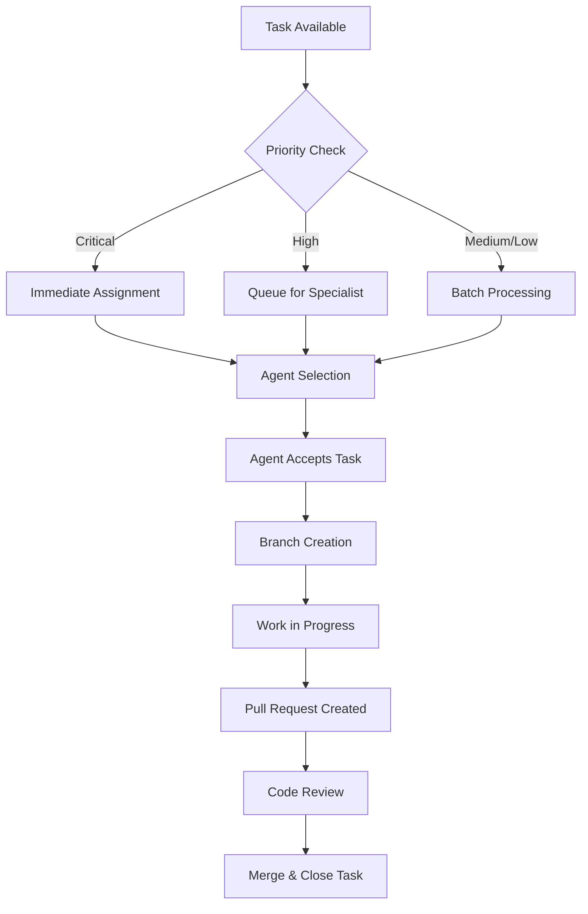

# 🤖 AGENT WORKFLOW MANAGEMENT - HydroML

## 📋 SISTEMA DE GESTIÓN DE TAREAS MULTI-AGENTE

### **🔄 WORKFLOW DE ASIGNACIÓN DE TAREAS**



---

## 🎯 ASIGNACIÓN DE AGENTES POR ESPECIALIZACIÓN

### **🐍 Python/Django Specialist**
- **Tareas**: TASK-001, TASK-002, TASK-004
- **Comando de Invocación**:
```bash
# Para el agente Python specialist
Eres un especialista en Python/Django del sistema CCPM de HydroML.

TU ESPECIALIZACIÓN: python-django-specialist
TASK ASIGNADA: [TASK-ID del PRODUCTION_TASKS.md]

PROTOCOLO:
1. Lee la tarea completa en docs/PRODUCTION_TASKS.md
2. Crea branch: task/[ID]-[descripcion-corta] 
3. Implementa los cambios según criterios de aceptación
4. Ejecuta tests: python manage.py test
5. Crea PR con template de reporte
6. Actualiza status en PRODUCTION_TASKS.md

CONTEXTO DEL PROYECTO: [Usar contenido de QUICK_AGENT_PROMPT.md]
```

### **🎨 Frontend Specialist**
- **Tareas**: TASK-003, TASK-007 (UI components)
- **Comando de Invocación**:
```bash
# Para el agente Frontend specialist  
Eres un especialista en Frontend/JavaScript del sistema CCPM de HydroML.

TU ESPECIALIZACIÓN: frontend-javascript-specialist
TASK ASIGNADA: [TASK-ID del PRODUCTION_TASKS.md]

PROTOCOLO:
1. Lee la tarea completa en docs/PRODUCTION_TASKS.md
2. Crea branch: task/[ID]-[descripcion-corta]
3. Optimiza archivos JS/CSS/HTML según criterios
4. Ejecuta: npm run build && python manage.py collectstatic
5. Valida con lighthouse/testing tools
6. Crea PR con métricas de performance

CONTEXTO DEL PROYECTO: [Usar contenido de QUICK_AGENT_PROMPT.md]
```

### **🗄️ Database Specialist**
- **Tareas**: TASK-004, migraciones complejas
- **Comando de Invocación**:
```bash
# Para el agente Database specialist
Eres un especialista en Base de Datos del sistema CCPM de HydroML.

TU ESPECIALIZACIÓN: database-sql-specialist  
TASK ASIGNADA: [TASK-ID del PRODUCTION_TASKS.md]

PROTOCOLO:
1. Analiza queries actuales con Django Debug Toolbar
2. Identifica N+1 queries y optimizaciones
3. Crea migraciones si necesario
4. Ejecuta: python manage.py makemigrations && python manage.py migrate
5. Valida performance con métricas antes/después
6. Documenta cambios de schema

CONTEXTO DEL PROYECTO: [Usar contenido de QUICK_AGENT_PROMPT.md]
```

---

## 📊 SISTEMA DE TRACKING Y REPORTE

### **🔍 ESTADO DE TAREAS - DASHBOARD**

```
PRODUCTION_TASKS.md - Live Status Dashboard

[🔴 CRITICAL] TASK-001: ⏳ IN PROGRESS  | Agent: python-specialist    | ETA: 2h
[🔴 CRITICAL] TASK-002: ⌛ PENDING     | Agent: experiments-specialist| ETA: TBD  
[🟡 HIGH]     TASK-003: 📋 QUEUED     | Agent: frontend-specialist  | ETA: TBD
[🟡 HIGH]     TASK-004: 📋 QUEUED     | Agent: database-specialist  | ETA: TBD
[🟡 HIGH]     TASK-005: ✅ COMPLETED  | Agent: devops-specialist    | Duration: 3.5h
```

### **📈 MÉTRICAS DE PROGRESO**

1. **Task Status Tracking**:
   - ⌛ PENDING (En queue)
   - ⏳ IN PROGRESS (Agente trabajando)  
   - 🔍 IN REVIEW (PR abierto)
   - ✅ COMPLETED (Merged)
   - ❌ BLOCKED (Requiere intervención)

2. **Performance Metrics**:
   - Tiempo estimado vs real
   - Calidad de código (linting, tests)
   - Impacto de la mejora (before/after)

---

## 🚀 PROTOCOLO DE EJECUCIÓN DE AGENTES

### **📋 TEMPLATE DE REPORTE ESTÁNDAR**

Cada agente debe generar este reporte al completar su tarea:

```markdown
## 🤖 AGENT TASK COMPLETION REPORT

**Agent**: [Specialist Type]
**Task**: [TASK-ID] - [Brief Description]  
**Branch**: [Branch Name]
**Duration**: [X hours Y minutes]
**Status**: ✅ COMPLETED

### 📊 CHANGES SUMMARY
- **Files Modified**: [Number]
- **Lines Added**: [+X]  
- **Lines Removed**: [-Y]
- **Tests Added**: [Number]

### 🔧 TECHNICAL DETAILS
- [Bullet point of key changes]
- [Performance improvements]
- [Bug fixes applied]

### 📈 IMPACT METRICS  
**Before**:
- [Baseline metric]
- [Performance data]

**After**:
- [Improved metric] 
- [Performance data]

**Improvement**: [X% faster/cleaner/etc]

### 🧪 TESTING
- [ ] Unit tests pass
- [ ] Integration tests pass  
- [ ] Manual testing completed
- [ ] No regressions detected

### 📝 NOTES & RECOMMENDATIONS
- [Any observations]
- [Future improvements suggested]
- [Dependencies or blockers noted]

### 🔗 REFERENCES
- PR: #[PR Number]
- Related Issues: [If any]
- Documentation Updated: [If any]
```

---

## 🎯 VALIDACIÓN DE COMPLETITUD

### **✅ CHECKLIST DE VALIDACIÓN AUTOMÁTICA**

Antes de marcar una tarea como COMPLETED, verificar:

1. **Code Quality Gates**:
   ```bash
   # Ejecutar en CI/CD pipeline
   python manage.py test                    # All tests pass
   flake8 .                                # No linting errors  
   black --check .                         # Code formatted
   python manage.py check --deploy         # Deployment ready
   ```

2. **Performance Gates**:
   ```bash
   # Métricas de performance
   python manage.py test --debug-mode      # Memory usage check
   lighthouse --only-categories=performance # Frontend metrics
   ```

3. **Documentation Gates**:
   - [ ] README.md actualizado si necesario
   - [ ] CHANGELOG.md entry agregado
   - [ ] API docs actualizados
   - [ ] Comentarios de código agregados

### **🔄 CONTINUOUS INTEGRATION HOOKS**

```yaml
# .github/workflows/task-validation.yml
name: Task Validation
on:
  pull_request:
    branches: [main]
    paths: ['task/**']

jobs:
  validate-task:
    runs-on: ubuntu-latest
    steps:
      - name: Run Quality Gates
        run: |
          python manage.py test
          flake8 .
          black --check .
      
      - name: Update Task Status  
        run: |
          # Auto-update PRODUCTION_TASKS.md status
          python scripts/update_task_status.py ${{ github.event.pull_request.head.ref }}
```

---

## 📋 COMANDOS RÁPIDOS PARA GESTIÓN

### **🚀 Para Iniciar Nueva Tarea**
```bash
# Asignar próxima tarea crítica disponible
python scripts/assign_next_critical_task.py

# Asignar tarea específica a agente
python scripts/assign_task.py --task=TASK-001 --agent=python-specialist
```

### **📊 Para Monitorear Progreso**
```bash
# Ver dashboard de status
cat docs/PRODUCTION_TASKS.md | grep -E "\[.*\].*:"

# Generar reporte de progreso
python scripts/generate_progress_report.py
```

### **🔍 Para Validar Completitud**
```bash
# Ejecutar todas las validaciones
python scripts/validate_task_completion.py TASK-001

# Generar métricas de impacto
python scripts/measure_task_impact.py --before=baseline --after=current
```

Este sistema garantiza que cada agente tenga:
- ✅ **Tareas claras y específicas**
- ✅ **Criterios de aceptación objetivos**  
- ✅ **Proceso de reporte estandarizado**
- ✅ **Validación automática de calidad**
- ✅ **Tracking completo en GitHub**